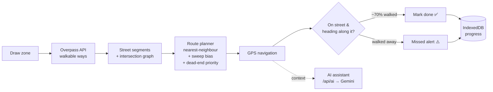

<div align="center">


# Covigo: Coverage Navigator

**Walk every street in an area, and miss none.**

Draw a zone on the map. Covigo pulls every walkable street from OpenStreetMap, orders them into an efficient walking route, then guides you turn by turn with GPS, marking streets done as you walk them and warning you when you skip one. An AI assistant with voice input answers questions about your progress.


[](https://vercel.com/new/clone?repository-url=https%3A%2F%2Fgithub.com%2Falokekissac%2FCovigo&project-name=covigo&env=GEMINI_API_KEY&envDescription=Google%20Gemini%20API%20key%20for%20the%20AI%20assistant&envLink=https%3A%2F%2Faistudio.google.com%2Fapikey)

</div>

---

## Why Covigo?

Canvassers, leaflet and flyer distributors, survey teams, census and delivery workers, and people who just want to walk every street in their neighbourhood all have the same problem: **covering every street in an area without doubling back or missing any.** Ordinary navigation apps route you from A to B. Covigo instead plans a route that covers *every street* and keeps track of what you've walked.

---

## ✨ Features

| | |
|---|---|
| 🗺️ **Draw any zone** | Polygon, rectangle or circle, drawn with Leaflet.Draw |
| 🛣️ **Real street data** | Pulls every walkable way (residential, service, footway, path, pedestrian, living street, tertiary and more) from the **Overpass API**, falling back across three mirrors |
| 🧭 **Route planning** | Builds an intersection graph and orders streets with a nearest-neighbour heuristic, plus a **sweep direction** (Auto, N→S, S→N, E→W, W→E) and **dead-end priority** |
| 📍 **Choose where to start** | Drop a start pin, or start from your GPS position; a guide line leads you to the first street |
| 🔀 **Turn-by-turn guidance** | A bearing-based manoeuvre engine gives straight, slight and full left or right, and U-turn instructions with the distance to the next street |
| ✅ **Automatic progress** | Streets are marked done once you've walked about 70% of their length (heading-checked, so walking past doesn't count) |
| ⚠️ **Missed-street alerts** | Warns when you walk away from a planned street without covering it, and lists missed streets to revisit |
| 📊 **Live stats** | Coverage %, streets done/remaining/missed, distance walked, **estimated houses** (8 m of street per house) and **time left** (at 1.3 m/s walking pace) |
| 💾 **Offline and resume** | Progress is saved in **IndexedDB**, and a **service worker** caches the map tiles you've viewed, so the map keeps working when signal drops |
| 🤖 **AI assistant** | A Gemini-powered chat that knows your live session (coverage, ETA, current and next street, missed streets), with **voice input** and **spoken replies** |
| 🔋 **Battery-aware GPS** | High-accuracy GPS while navigating, a lower-power mode when idle, and position updates limited to about 1 per second |

---

## 🧠 How it works



**Route planning.** Each street becomes a segment, and its endpoints become nodes in an intersection graph (degree-1 nodes are dead ends). Starting from your pin, your GPS position or the edge of the zone in the chosen sweep direction, the planner repeatedly picks the unvisited segment with the lowest cost:

```
cost = distance to its nearest endpoint
     + penalty for moving against the sweep direction
     − 40% of that distance if it is a dead end   (so cul-de-sacs get done early)
```

This is a fast greedy heuristic that runs instantly in the browser, even for hundreds of streets. It doesn't give a provably optimal route (that would be the NP-hard *Rural Postman Problem*).

**Completion detection.** While you're within about 10 m of the current street and heading roughly along it (±40°), GPS points count toward that street. A street is done once the points cover about 70% of its length, or when you reach its far end.

**AI assistant.** Every message sends a compact snapshot of your session (phase, coverage, distances, ETA, current and next street, missed streets) as the system prompt. The browser calls `/api/ai`, a Vercel serverless function that adds your Gemini key server-side, so the key never reaches the browser.

---

## 🗂️ Project structure

```
.
├── index.html                  # The whole app: UI, map, routing, navigation, AI chat
├── sw.js                       # Service worker: caches viewed OSM tiles for offline use
├── manifest.webmanifest        # Installable PWA metadata
├── icon.svg
├── api/ai.js                   # Vercel serverless function: Gemini proxy (key stays server-side)
└── vercel.json                 # Security headers + service-worker caching
```

No build step and no framework: one HTML file, with Leaflet and Leaflet.Draw loaded from a CDN.

---

## 🚀 Deploy your own (free)

Click **Deploy with Vercel** at the top: it asks for your Gemini key and deploys everything in about a minute. Or do it manually:

1. **Get a Gemini API key** at [aistudio.google.com/apikey](https://aistudio.google.com/apikey).
2. **Import the repo** at [vercel.com/new](https://vercel.com/new). There's no build step and nothing to configure: the static app is served from the root, and `api/ai.js` becomes the `/api/ai` function.
3. **Add environment variables** under *Project → Settings → Environment Variables*:

   | Variable | Required | Purpose |
   |---|:---:|---|
   | `GEMINI_API_KEY` | ✅ | Your Gemini key |
   | `GEMINI_MODEL` | – | Comma-separated models to try in order. Default: `gemini-flash-lite-latest, gemini-3.1-flash-lite, gemini-3.6-flash` |

4. **Deploy** (or redeploy after adding the key). The map and navigation work without a key; only the AI assistant needs one.

**Run locally:** `npx vercel dev` serves the site and the function together at `http://localhost:3000`. GPS and the service worker need `localhost` or HTTPS.

---

## 🔒 Security & fair use

- The Gemini key is stored only in Vercel's environment and sent as a request header, never in the browser or in URLs.
- The AI endpoint accepts **same-origin POST requests only** (no open CORS). It validates the conversation format and caps it at 24 turns, 2,000 characters per message and 400 output tokens.
- Chat replies are HTML-escaped before rendering, and `vercel.json` adds `nosniff`, referrer and permissions-policy headers (location and microphone allowed for this site only).
- Map data © [OpenStreetMap](https://www.openstreetmap.org/copyright) contributors. Tiles are cached only after you view them (no bulk prefetching), in line with the [OSM tile usage policy](https://operations.osmfoundation.org/policies/tiles/).

---

## 🧭 Roadmap

- Solve the Rural Postman Problem more closely (matching odd-degree nodes, as in the Chinese Postman approach) for shorter routes
- Export and share routes as GPX, and support multiple walkers splitting one zone
- Per-street notes (e.g. "no answer", "revisit") for canvassing workflows
- Better house estimates using OSM building footprints instead of street length

---

## 👤 Author

**Aloke**, AI Engineer & Full-Stack Developer · Dublin, Ireland
[GitHub](https://github.com/alokekissac) · [LinkedIn](https://www.linkedin.com/in/alokekisssac/)
